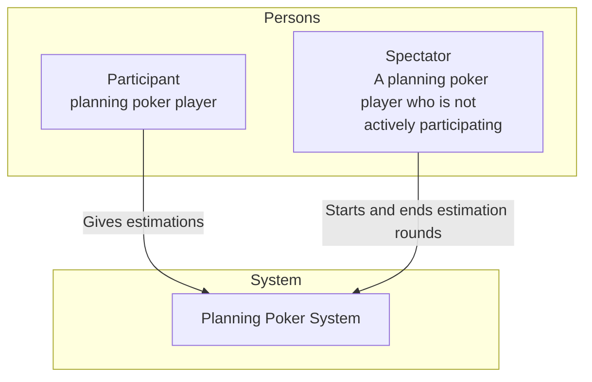
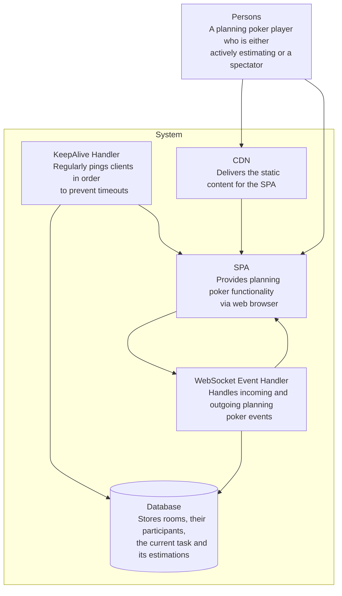

# Introduction

```code
   _____  _                   _                _____      _
   |  __ \| |                 (_)              |  __ \    | |
   | |__) | | __ _ _ __  _ __  _ _ __   __ _   | |__) |__ | | _____ _ __
   |  ___/| |/ _` | '_ \| '_ \| | '_ \ / _` |  |  ___/ _ \| |/ / _ \ '__|
   | |    | | (_| | | | | | | | | | | | (_| |  | |  | (_) |   <  __/ |
   |_|    |_|\__,_|_| |_|_| |_|_|_| |_|\__, |  |_|   \___/|_|\_\___|_|
                                        __/ |
                                       |___/
```

Planning Poker is a real-time application to help perform estimation sessions in agile teams working together remotely.
Users can join planning rooms where they meet with the other participants. Users can start estimations for tasks, give their estimates and reveal the results.

At the moment there are 2 **frontends**:

- a web-based Single Page app built with Elm ([https://planningpoker.cc](https://planningpoker.cc))
- an iOS App built with SwiftUI ([iOS App Store](https://apps.apple.com/app/planning-poker-for-teams/id1495956287))

This **backend** provides the Websocket endpoint to be used by these frontends. It is built on AWS using a serverless, event-driven architecture utilizing the services API Gateway, Lambda and DynamoDB. It is configured with CDK.

## Getting started

- Install the dependencies: `yarn install`
- Run feature tests: `yarn features`
- Deploy infrastructure: `yarn deploy`

For details see `package.json`.

## How estimation works

This section describes how an estimation takes place and how the server handles different events in its respective state.

_Event types_:

```code
# Joining a room
joinRoom(userName: string, roomName: string, isSpectator: boolean)
userJoined(userName: string, isSpectator: boolean)
userLeft(userName: string)
startEstimation(userName: string, taskName: string, startDate: string)

# Estimating
estimate(userName: string, taskName: string, estimate: string)
userHasEstimated(userName: string, taskName: string)

# Ending current estimation round
showResult(userName: string)
estimationResult(taskName: string, startDate: string, endDate: string, estimates: { userName: string, estimate: string }[])
```

These events are exchanged as JSON in the following format:

```json
{
  "eventType": "estimate",
  "userName": "some-user",
  "taskName": "some-task",
  "estimate": "7"
}
```

In order to try out the API you can connect to the websocket endpoint with a tool like `wscat`:

```sh
npx wscat -c "wss://api.planningpoker.cc/dev"
```

## Estimation stages

### 1. Join a room

All clients keep a list of other users in the current planning session. When users join or leave the room this is broadcasted to all connected clients with either `userJoined` or `userLeft` events.

After establishing the websocket connection a user enters a room by sending a `joinRoom` message. If the new user joins a room which already hosts participants, this user receives all other members as separate `userJoined` events. Users can join or leave at any time.

Participants which do not take part in the estimation itself can join as "spectators". In this case they cannot give estimates but can start new estimations or request revealing the results. This can be useful for non-estimating participants (in development teams these would typically be PO and Scrum master).

### 2. Estimate

Any user can initiate a new estimation round by sending a `startEstimation` event. If no estimation is running at the moment, the event is broadcasted to all clients (in case of an ongoing estimation it is ignored).

If a client receives a `startEstimation` event it will display a screen for entering the complexity for a task assumed by the participant. If a client connects after an estimation has been started (but not finished), it will receive this event directly after having been sent the list of `userJoined` events.

Clients can now send their estimation to the server with an event of type `estimate`. More than one `estimate` can be sent for the same task for the same user. The server collects incoming estimations and broadcasts them with an `userHasEstimated` event (which does not include the estimate).

### 3. Finalize round (display result, start next estimation round)

Only when all users (except spectators) have submitted their estimations, the result can be requested with `showResult`. As a response the server broadcasts the estimations of all users with `estimationResult`. In case not all estimations have been received, it will be ignored by the server.

After the estimation result is revealed, any user can send a new `startEstimation` in order to start another round.

## Architecture





```code

                   API Gateway                Lambda                  DynamoDB
                   (Websocket)
 ┌──────┐            ┌────┐
 │Client│◀────┐      │    │             ┌─────────────────┐       ┌───────────────┐
 └──────┘      │     │    │             │                 │   ┌──▶│ Participants  │
 ┌──────┐   Messages │    │ Invocations │ WebSocket Event │   │   └───────────────┘
 │Client│◀────┼─────▶│    │────────────▶│  LambdaHandler  │◀──┤
 └──────┘     │      │    │◀────────────│                 │   │   ┌───────────────┐
 ┌──────┐     │      │    │  Messages   └─────────────────┘   └──▶│     Rooms     │
 │ ...  │◀────┘      │    │                                       └───────────────┘
 └──────┘            └────┘
```

## Data model

### Participants

_Fetch user information by connectionId._

| Attribute    | Type                   | Description              |
| :----------- | :--------------------- | :----------------------- |
| connectionId | Partition Key (String) | ID of the connected user |
| roomName     | Attribute (String)     | Room name                |
| name         | Attribute (String)     | Name                     |
| isSpectator  | Attribute (Boolean)    | Is user a spectator?     |

### Rooms

_Fetch room details (list of all participants' connectionIds, current task, current estimation values)._

| Attribute                  | Type                   | Description                                      |
| :------------------------- | :--------------------- | :----------------------------------------------- |
| name                       | Partition Key (String) | Room name                                        |
| participants               | List (String)          | `connectionId`s of all members in a room         |
| currentEstimationTaskName  | Attribute (String)     | Task name (can also be empty)                    |
| currentEstimationStartDate | Attribute (String)     | Start date (can also be empty)                   |
| currentEstimationInitiator | Attribute (String)     | ID of Initiator (can also be empty)              |
| currentEstimates           | List (String)          | All estimates (`{"connectionId:":"value":"10"}`) |
